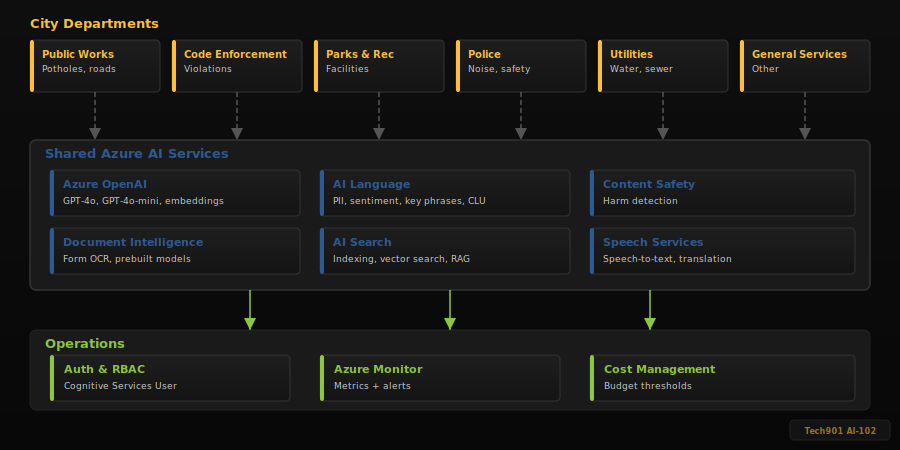
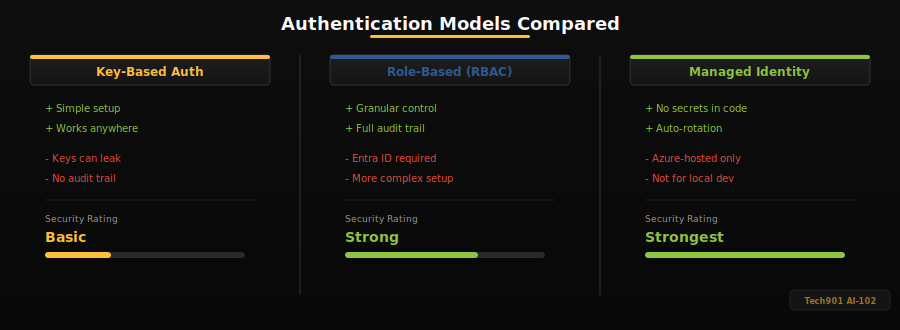

# Architect the Platform

The City of Memphis is modernizing six departments with Azure AI services. You have been hired as the **AI Solutions Architect** to design the platform. Your job: match each department's pain point to the best Azure AI service, validate the security of your configuration, estimate costs, and build a monitoring plan.

This activity is entirely offline -- no live API calls, no Azure credentials needed. You will work with a local service catalog and produce two output files that autograding validates.

> [!NOTE]
> In Activity 1 you made live API calls. This activity is entirely offline -- you will design and plan before building. The architecture you create here becomes the blueprint for Activities 3-7.

## What You Will Build

| Output | Description |
|--------|-------------|
| `design.json` | Architecture design: service selections for 6 departments + shared resources |
| `result.json` | Cost estimates, budget flags, and monitoring plan |

You do not create these files yourself. The `main()` function in `app/main.py` calls your functions, collects the results, and writes both files automatically. Your job is to implement the functions marked with `# TODO`.

> [!IMPORTANT]
> **`app/main.py` is the only file you need to edit.** The other files in `app/` (`services.py`, `config_loader.py`, `cost_estimator.py`) are read-only helpers that your code calls — do not modify them.

## What You Will Learn

- Map real-world requirements to specific Azure AI services (AI-102 Objective 1.1)
- Identify the correct SDK package for each service (Objective 1.2)
- Estimate costs and flag budget overruns (Objective 1.3)
- Build monitoring plans with real Azure Monitor metrics



## Setup

All commands in this activity must be run from the **activity root folder** — the folder that contains `app/`, `data/`, and `tests/`. In Codespaces this is your default directory. If you get `ModuleNotFoundError` or `FileNotFoundError`, you are probably in the wrong folder.

```bash
pip install -r requirements.txt
cp .env.example .env
```

The second command copies the placeholder environment file. Your code does not make live API calls, but the config loader reads these values when `main.py` runs.

> [!NOTE]
> The `&&` in commands throughout this guide means "only run the next command if the previous one succeeded." For example, `python app/main.py && pytest tests/ -v` runs your code first and only runs tests if it finished without errors.

---

# Part A: Architecture Decisions

In this part you will implement two functions: `build_architecture_decisions()` and `build_shared_resources()`. Together they produce `design.json`.

## Explore the Input Data

Before writing code, open these two files to understand what you are working with:

> [!NOTE]
> You will also see a file called `data/usage_scenarios.json` in the `data/` folder — that file is used in Part B for cost estimation. You don't need it yet.

**`data/city_scenarios.json`** — The six department scenarios. Each has:

| Field | Example | Description |
|-------|---------|-------------|
| `department` | `"311 Call Center"` | Department name |
| `pain_point` | `"Classify 2,000+ daily citizen complaints..."` | The problem to solve |
| `capability_needed` | `"classification"` | The AI capability required |
| `volume` | `"2000 requests/day"` | How much data the department processes |
| `constraints` | `["must handle free-text input", ...]` | Requirements the solution must meet |

**`app/services.py`** — The service catalog. It contains `AZURE_AI_SERVICES`, a dictionary of 7 Azure AI services. Each entry includes:

| Field | Description |
|-------|-------------|
| `capabilities` | What the service can do (e.g., `"classification"`, `"pii_redaction"`) |
| `sdk` | The Python SDK package name |
| `models` | Available models or tiers |
| `use_cases` | Common real-world applications |
| `responsible_ai` | Key ethical considerations |

## Understand get_service_by_capability()

At the bottom of `app/services.py` there is a helper function called `get_service_by_capability()`. It takes a capability string and returns a list of all services that support it. Many capabilities are shared -- Azure OpenAI (GPT-4o) can technically do classification, PII redaction, form extraction, and image classification, so the function often returns multiple matches:

```python
>>> get_service_by_capability("classification")
['azure_openai', 'ai_language']

>>> get_service_by_capability("pii_redaction")
['azure_openai', 'ai_language']

>>> get_service_by_capability("form_extraction")
['azure_openai', 'document_intelligence']

>>> get_service_by_capability("full_text_search")
['ai_search']
```

## Implement find_services()

Before proceeding, you'll need to find out what services match the capabilities required by each department. Complete the function `find_services()` to get a list of valid services for each usage scenario. Use `get_service_by_capability` for each scenario in the scenarios list, then save that information to a dict.


> [!NOTE]
> Make sure you have a list of services for each scenario before proceeding. Run main.py to see it
> ```bash
> python app/main.py
> ```

When multiple services match, you need to decide which one fits best. Consider these factors:

| Factor | Question to Ask |
|--------|----------------|
| **Purpose-built vs. general** | Does a specialized service handle this task out of the box, or would GPT-4o require custom prompting? |
| **Cost** | Is a cheaper per-unit service available for high-volume scenarios? |
| **Accuracy** | Does a specialized service offer higher reliability for structured tasks (e.g., PII entity types, OCR field extraction)? |
| **Constraints** | Does the scenario require specific features (e.g., handwriting recognition, real-time processing) that one service handles better? |

> [!IMPORTANT]
> **How to Choose a Service**
>
> When multiple services match a capability, the key question is: **which service is the best fit for this specific task?** Read the scenario's `pain_point` and `constraints` carefully — they tell you what the department actually needs. Notice that "specialized beats general-purpose" is not always the rule — sometimes OpenAI IS the best tool. Consider whether a purpose-built service handles the task out of the box, or whether it requires custom setup that may not fit the scenario's constraints.

## Implement build_architecture_decisions()

Find `build_architecture_decisions()` in `app/main.py`. It returns a list of 6 dicts — one per department. The first entry (311 Call Center) is already filled in as an example. Your job is to fill in the remaining 5 empty dicts.

**What each dict must contain — these exact keys:**

| Key | Type | What to put here |
|-----|------|-----------------|
| `department` | str | The department name from `city_scenarios.json` (must match exactly) |
| `primary_service` | str | A key from `AZURE_AI_SERVICES` (e.g., `"document_intelligence"`) |
| `model_or_tier` | str | A model name from that service's `models` list (e.g., `"prebuilt-layout"`) |
| `sdk_package` | str | The `sdk` value from the catalog (e.g., `"azure-ai-formrecognizer"`) |
| `justification` | str | 2-3 sentences (at least 20 words) explaining why this service fits the department's needs |
| `alternative_considered` | str | A **different** service key you evaluated (e.g., `"azure_openai"`) — must not be the same as `primary_service` |
| `why_not_alternative` | str | Why the alternative was not chosen |
| `responsible_ai_considerations` | list[str] | At least one item from the service's `responsible_ai` list in `app/services.py` |

**How to fill in each department:**

1. Open `data/city_scenarios.json` and read the department's `pain_point` and `constraints`
2. Use `get_service_by_capability()` or read `app/services.py` to find which services support that capability
3. Decide which service is the best fit — consider purpose-built vs general, cost, accuracy, and the scenario's constraints
4. Look up `sdk`, `models`, and `responsible_ai` in `AZURE_AI_SERVICES` for your chosen service
5. Write a unique justification explaining your reasoning (at least 20 words)
6. Name a real alternative you considered and explain the tradeoff

Look at the provided 311 Call Center example in the code to see exactly how a completed entry looks.

> [!WARNING]
> **Common mistakes that will fail the hidden grading tests:**
> - Copy-pasting the same justification for every department. Each justification must be unique and specific to that department's pain point.
> - Setting `alternative_considered` to the same value as `primary_service`. The alternative must be a different service.
> - Using a URL (like `https://myresource.openai.azure.com`) as your `primary_service` or `alternative_considered`. These fields expect a service key from the catalog (e.g., `"azure_openai"`, `"document_intelligence"`), not a URL.

## Implement build_shared_resources()

Find `build_shared_resources()` in `app/main.py`. Return a dict with exactly three keys:

| Key | What to put here |
|-----|-----------------|
| `resource_group` | A resource group name following Azure naming conventions (e.g., `rg-` prefix) |
| `auth_model` | A sentence describing your chosen authentication approach — mention at least one of: key-based, RBAC, or managed identity. The hidden tests check that this field is a non-empty string. |
| `networking` | A sentence describing your network security approach |

Consider what may be the best approach for this set of problems. The resource group doesn't need to actually exist- just choose a name that seems appropriate.

> [!IMPORTANT]
> **Authentication Models — Know These for the Exam**
>
> | Approach | How It Works | Pros | Cons |
> |----------|-------------|------|------|
> | Key-based | Pass an API key in each request | Simple setup, works everywhere | Keys can leak, no audit trail, shared across users |
> | RBAC | Azure AD role assignments (e.g., `Cognitive Services User`) | Granular, auditable, per-user | Requires Azure AD setup |
> | Managed Identity | Azure automatically provisions credentials | No secrets in code, auto-rotated | Only works in Azure-hosted environments |

> [!NOTE]
> **Self-Check** (20 points)
> ```bash
> python app/main.py && pytest tests/test_basic.py::test_scenarios_present tests/test_basic.py::test_scenario_required_keys tests/test_basic.py::test_shared_resources_present -v
> ```

---

# Part B: Estimate Costs & Build Monitoring Plan

In this part you will implement three functions: `estimate_cost()`, `check_budget()`, and `build_monitoring_plan()`. These produce the cost and monitoring portions of `result.json`.

### Why Monitor AI Workloads?

AI services introduce risks that traditional software does not: **model drift** (accuracy degrades as real-world data shifts), **token cost spikes** (a verbose prompt can 10x your bill overnight), and **latency cascades** (one slow model call blocks the entire pipeline). Monitoring with Azure Monitor metrics lets you catch these problems before they affect citizens.

> [!IMPORTANT]
> **Exam Connection (D1.2)**: The following topics appear on the exam but are NOT practiced in this activity. Review them in the textbook. Know that production AI pipelines store secrets in **pipeline variables** (not code), run **evaluation gates** that block deployment if accuracy drops below a threshold, and use **blue-green deployments** to roll back bad model versions. Also know when to deploy AI models in **containers**: when you need low-latency inference, air-gapped environments, or data sovereignty compliance.

## Understand the data files

Two JSON files drive cost estimation. Open both before writing code:

**`data/usage_scenarios.json`** — How much each department uses their service:

```json
{
  "department": "311 Call Center",
  "service": "azure_openai",
  "monthly_volume": 60000,
  "unit": "1K tokens",
  "budget_threshold_usd": 250.00
}
```

**`data/pricing_catalog.json`** — How much each service costs per unit:

```json
"azure_openai": {
  "unit_cost_usd": 0.005,
  "unit": "1K tokens"
}
```

The connection between the two files is the `service` field. For each usage scenario, you look up the unit cost in the pricing catalog using that service key.

> [!NOTE]
> **Flat monthly pricing**: AI Search uses flat monthly pricing, not per-request pricing. In the data, Parks & Recreation has `monthly_volume: 1` and `unit: "monthly (S1 tier)"` — this means "one month of service at $250/month." The math still works the same way: `1 × 250.00 = $250.00`.

## Implement estimate_cost()

Find `estimate_cost()` in `app/main.py`. The `main()` function calls this once for each of the 6 departments, passing in one usage scenario at a time.

**What this function receives:**
- `usage_item` — one entry from `usage_scenarios.json` (e.g., the 311 Call Center entry above)
- `pricing` — the full pricing catalog dict from `pricing_catalog.json`

**What this function must return — a dict with these exact keys:**

| Key | Type | What to put here |
|-----|------|-----------------|
| `department` | str | Copy from `usage_item["department"]` |
| `service` | str | Copy from `usage_item["service"]` |
| `monthly_volume` | int | Copy from `usage_item["monthly_volume"]` |
| `unit` | str | Copy from `usage_item["unit"]` |
| `unit_cost_usd` | float | Look up from pricing catalog (see below) |
| `monthly_cost_usd` | float | Calculate: `monthly_volume * unit_cost_usd` |
| `within_budget` | bool | `True` if `monthly_cost_usd <= budget_threshold_usd` |
| `budget_threshold_usd` | float | Copy from `usage_item["budget_threshold_usd"]` |

**How to look up the unit cost:**

Open `data/pricing_catalog.json` and look at how prices are organized. Each service has a `unit_cost_usd` value you need to access. Figure out the dict path by reading the file structure.

**Example calculation — 311 Call Center:**
- `monthly_volume` = 60,000
- `unit_cost_usd` = 0.005 (look this up from the pricing catalog for `azure_openai`)
- `monthly_cost_usd` = 60,000 × 0.005 = **$300.00**
- `budget_threshold_usd` = 250.00
- `within_budget` = 300.00 <= 250.00 → **False** (over budget!)

**Example calculation — Public Works:**
- `monthly_volume` = 2,000
- `unit_cost_usd` = 0.01 (look this up from the pricing catalog for `document_intelligence`)
- `monthly_cost_usd` = 2,000 × 0.01 = **$20.00**
- `budget_threshold_usd` = 15.00
- `within_budget` = 20.00 <= 15.00 → **False** (also over budget!)

## Implement check_budget()

Find `check_budget()` in `app/main.py`. This function receives the list of all 6 cost estimate dicts (the return values from `estimate_cost()`).

Return a list of department name strings where `within_budget` is `False`.

> [!IMPORTANT]
> A department is **over budget** when `monthly_cost_usd > budget_threshold_usd` (strictly greater than).

## Implement build_monitoring_plan()

Find `build_monitoring_plan()` in `app/main.py`. This function receives two parameters:
- `estimates` — the list of cost estimate dicts you produced in `estimate_cost()`
- `over_budget` — the list of department names that exceeded their budget (from `check_budget()`)

Your monitoring plan must be **connected to the cost analysis**. Departments that are over budget need targeted alerts.

Open `app/cost_estimator.py` and look at the `AZURE_MONITOR_METRICS` dictionary. It maps service names to their real Azure Monitor metric names. Use `get_metrics_for_service("azure_openai")` to look up what metrics are available for a given service.

**What this function must return — a dict with these exact keys:**

| Key | Type | What to put here |
|-----|------|-----------------|
| `metrics_to_track` | list[dict] | At least 3 metrics, each with `metric`, `service`, and `purpose` keys |
| `alert_rules` | list[dict] | At least 1 alert rule **per over-budget department**, each with `department`, `condition`, and `action` keys |

**Example alert rule** (for 311 Call Center, which uses `azure_openai`):

```python
{
    "department": "311 Call Center",
    "condition": "TokenTransaction > 50000 per day",
    "action": "Email platform-admin@memphis.gov to review token usage"
}
```

The `condition` must reference a real metric name from `AZURE_MONITOR_METRICS` for that department's service. Use the `estimates` list to find which service each over-budget department uses, then call `get_metrics_for_service()` to find valid metric names.

Use real metric names from `AZURE_MONITOR_METRICS` — do not make up metric names.

> [!IMPORTANT]
> **Monitoring Categories (AI-102 Objective 1.3)**
>
> Production AI platforms group metrics into three monitoring categories:
>
> | Category | What It Tracks | Example Metric |
> |----------|---------------|----------------|
> | **Performance** | Latency and throughput | `AzureOpenAITimeToResponse` |
> | **Volume** | Usage and token consumption | `TokenTransaction`, `AzureOpenAIRequests` |
> | **Responsible AI** | Content filtering and safety | `RAIRejectedRequests` |
>
> `RAIRejectedRequests` counts how many requests Azure's content filters blocked -- a direct indicator that your Responsible AI guardrails are working. The exam expects you to know which metrics map to which category.

> [!NOTE]
> **Self-Check** (20 points)
> ```bash
> python app/main.py && pytest tests/test_basic.py::test_cost_estimates_present tests/test_basic.py::test_monitoring_plan_present tests/test_basic.py::test_total_cost_present -v
> ```

---

# Run All Tests & Submit

Run the complete pipeline and check your work against all visible tests.

## Generate Both Output Files

```bash
python app/main.py
```

You should see output confirming both `design.json` and `result.json` were written.

## Run All Visible Tests

```bash
pytest tests/ -v
```

All tests should pass (green). If any fail, read the assertion message, fix your code, and re-run:

```bash
python app/main.py && pytest tests/ -v
```

## What You Practiced

- **AI-102 Objective 1.1**: Selecting Azure AI services for real-world scenarios
- **AI-102 Objective 1.2**: Planning service deployment (SDKs, models, tiers)
- **AI-102 Objective 1.3**: Cost estimation, budget management, and monitoring for Azure AI resources
- Monitoring with real Azure Monitor metric names

> [!NOTE]
> **Cross-Activity Reference**: The architecture you design here becomes the blueprint for Activities 3-7. Every service you select, every authentication model you evaluate, and every monitoring metric you choose will reappear when you build the actual components.

> [!TIP]
> **Stretch Goal**: Design a 7th department scenario (e.g., Memphis Fire Department) with its own capability need, service selection, cost estimate, and justification.

> [!TIP]
> **Stretch Goal — Deployment Plan (AI-102 Objective 1.2)**
>
> Add a `deployment_plan` key to your `design.json` covering the four decisions an AI-102 architect must make before deploying:
> ```json
> "deployment_plan": {
>   "region": "eastus2",
>   "region_justification": "Closest to Memphis; supports all required AI services",
>   "sku_selection": {
>     "azure_openai": "S0",
>     "ai_search": "standard"
>   },
>   "rbac_roles": [
>     "Cognitive Services User",
>     "Search Index Data Reader"
>   ],
>   "network_approach": "public_with_key_auth"
> }
> ```
> This is ungraded, but the exam tests region selection, SKU trade-offs, RBAC role assignment, and network security decisions.

## Troubleshooting

1. **`ModuleNotFoundError: No module named 'services'`** -- Make sure you're running `python app/main.py` from the folder that contains `app/`
2. **`FileNotFoundError` for data files** -- Run commands from the folder that contains `data/` and `app/`
3. **`KeyError` on pricing lookup** -- Open `data/pricing_catalog.json` and look at the structure carefully. The keys are nested — trace the path from the top-level key to the unit cost
4. **`python: command not found`** -- Some systems use `python3` instead of `python`. In Codespaces, `python` works. On macOS/Linux, try `python3`. On Windows, try `py`. Use whichever command responds to `--version` and substitute it throughout.
5. **Reading test output** -- Green `PASSED` means the test passed. Red `FAILED` means something is wrong. Read the line starting with `AssertionError` — it tells you what was expected vs. what your code returned. For example, `AssertionError: Expected 6 justifications, got 0` means your `build_architecture_decisions()` returned empty dicts. Fix the code, re-run `python app/main.py` to regenerate the output files, then re-run the tests.

---

# Reference: Configuration Validation & Security Audit

> [!NOTE]
> `run_security_audit()` and `compare_auth_models()` are **pre-implemented** — you do not need to write them. `validate_service_config()` has a TODO for the regex pattern only. Read this section to understand the concepts, which appear on the AI-102 exam under Objective 1.3.

## Endpoint Validation

Azure AI services use three URL patterns for their endpoints:

| Service Type | URL Pattern |
|-------------|------------|
| Azure OpenAI | `https://your-resource.openai.azure.com` |
| AI Language, Document Intelligence, etc. | `https://your-resource.cognitiveservices.azure.com` |
| Azure AI Search | `https://your-resource.search.windows.net` |

The `validate_service_config()` function in `main.py` needs a regex pattern to check whether a given endpoint matches one of these domains. Use Python's `re` module (already imported) with `re.match()` to check the endpoint. Store your pattern string in the `pattern` variable — it gets returned as `endpoint_pattern` in the output.

## Authentication Models

> [!IMPORTANT]
> **Know These for the Exam (AI-102 Objective 1.3)**
>
> | Approach | How It Works | Pros | Cons |
> |----------|-------------|------|------|
> | Key-based | Pass an API key in each request | Simple setup, works everywhere | Keys can leak, no audit trail, shared across users |
> | RBAC | Azure AD role assignments (e.g., `Cognitive Services User`) | Granular, auditable, per-user | Requires Azure AD setup |
> | Managed Identity | Azure automatically provisions credentials | No secrets in code, auto-rotated | Only works in Azure-hosted environments |

The `compare_auth_models()` function returns a summary comparing all three approaches. The `run_security_audit()` function checks project-level security posture: whether `.gitignore` blocks `.env` files, whether API keys are present, and whether any Python files contain hardcoded secrets.



> [!NOTE]
> **Reflection** (5 points) -- See `REFLECTION.md`
